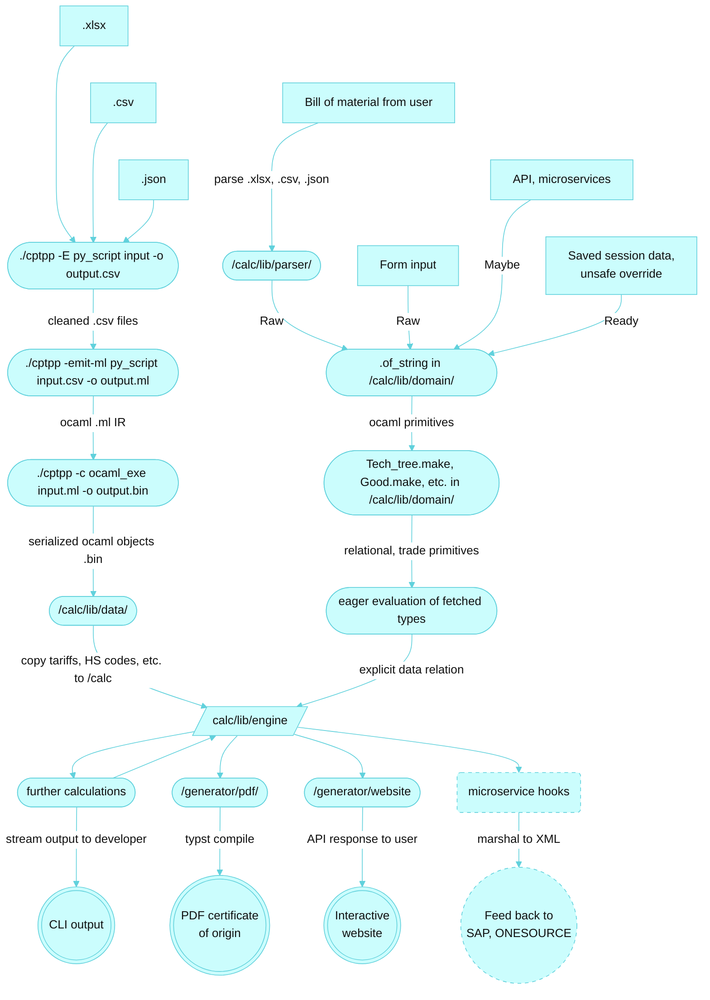

<!--
 SPDX-License-Identifier: GPL-3.0-only
 Copyright (C) 2026 Nguyễn Hoàng An
-->

<h1 align="center">

</h1>

Photo by [Carl Campbell](https://www.flickr.com/photos/carlbcampbell/40771198003/) (CC BY). Hatsune Miku © Crypton Future Media, Inc. 2007 (CC BY-NC)

----

**This calculator is for intuition/informational/education purposes, not for actual legal work. Please read the GPL-3.0 license before usage because it contains important legal information.**

The calculator uses the [official CPTPP text](https://www.mfat.govt.nz/en/trade/free-trade-agreements/free-trade-agreements-in-force/cptpp/comprehensive-and-progressive-agreement-for-trans-pacific-partnership-text-and-resources).

I am making an open-source software suite to help small businesses getting used to Comprehensive and Progressive Agreement for Trans-Pacific Partnership (CPTPP) procedures. 

I added extensive imagery of Hatsune Miku since adding cartoon characters to ease understanding of complex business procedures is a norm in Asian countries. These imageries are allowed for use, since Hatsune Miku is licensed under CC BY-NC license and this software is strictly used for non-commercial purposes.

If I have to say, the closest thing to this is the specialized CPTPP of these softwares:
- [Thompson Reuters ONESOURCE Free Trade Agreement Management](https://tax.thomsonreuters.com/en/onesource/global-trade-management/free-trade-agreement)
- [SAP Global Trade Services, Preference Management](https://www.sap.com/products/financial-management/global-trade-management.html)

## Data flowchart

